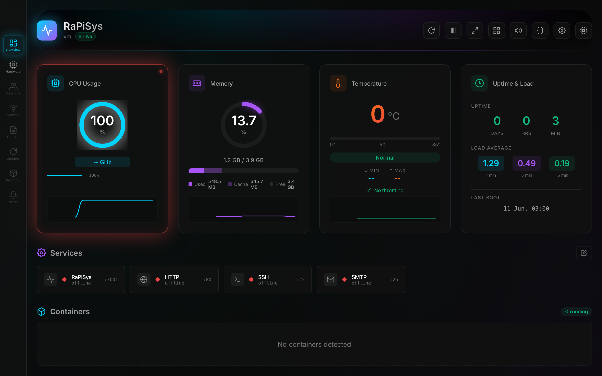
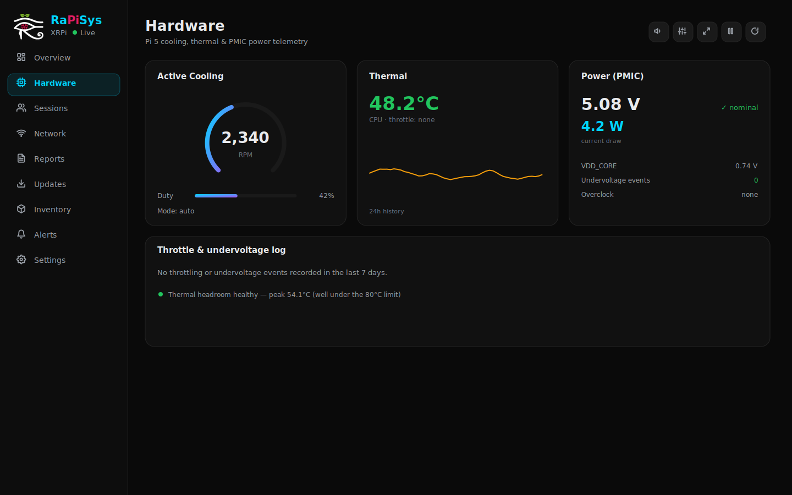
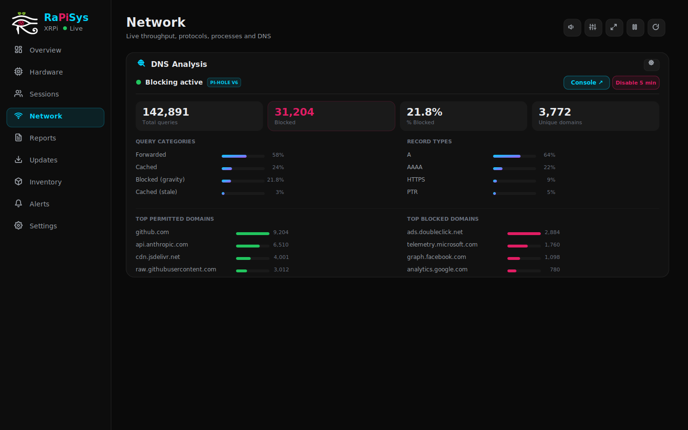
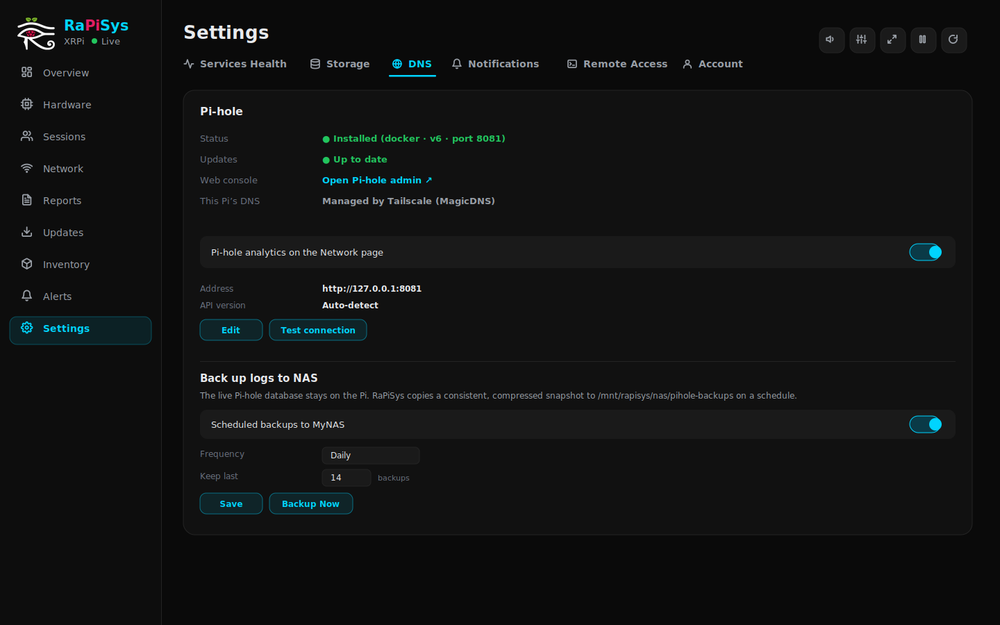
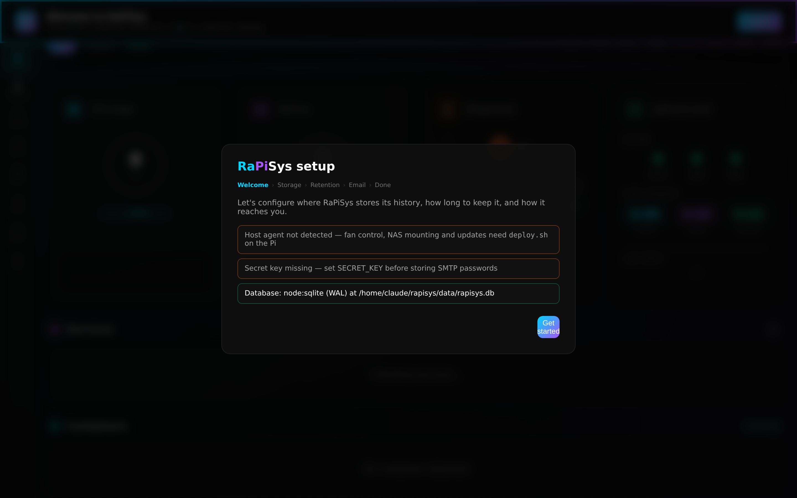
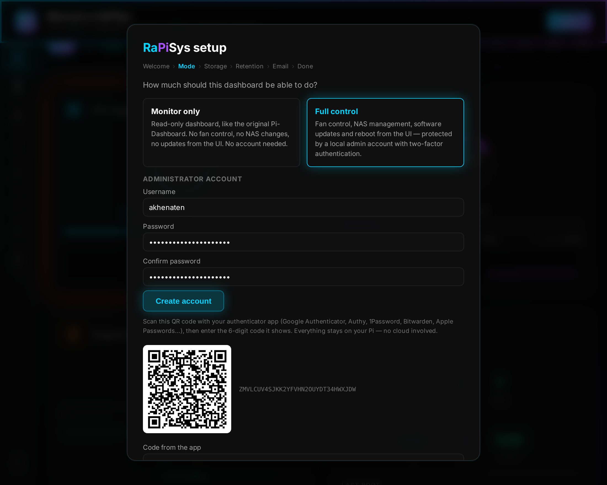
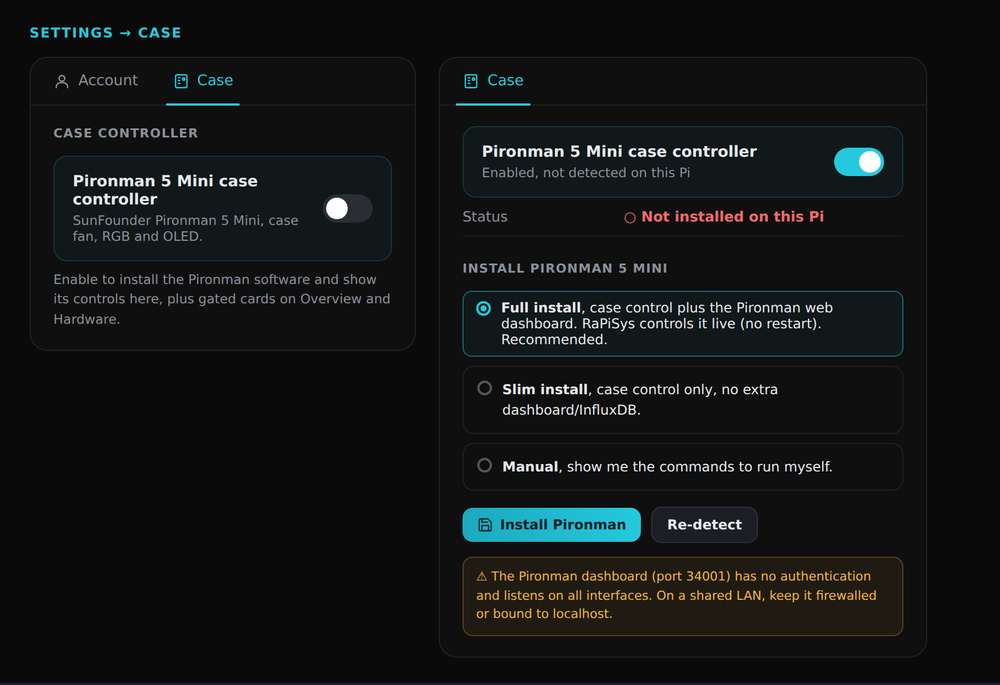
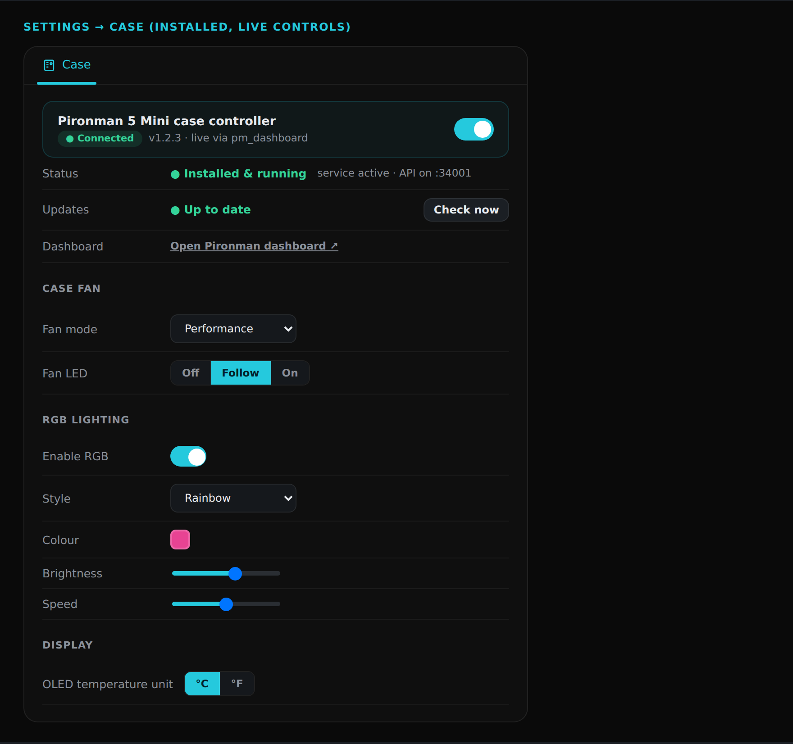
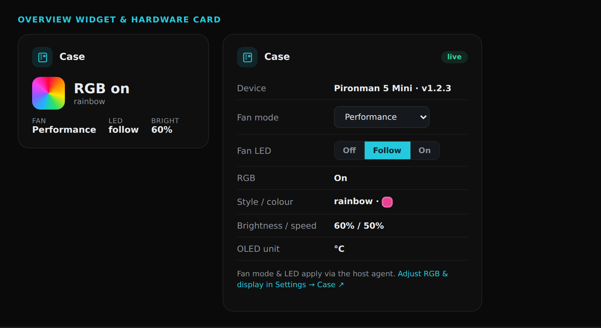

<div align="center">

# RaPiSys

**A production-grade system dashboard for the Raspberry Pi 5**

Active-cooling & PMIC telemetry · server-side metric history on your NAS · Pi-hole DNS analytics & one-click install · network/sessions/reports/inventory/updates · email & Telegram alerting · hardened container + host-agent architecture

*Based on the excellent [zepgram/pi-dashboard](https://github.com/zepgram/pi-dashboard) (MIT), extended for Pi 5 deployments.*

</div>

---



## Why RaPiSys?

The upstream dashboard is a great live view, but everything it shows lives in your browser and disappears on refresh, and nothing is collected while no tab is open. RaPiSys adds a **server-side brain**: a background sampler records metrics into SQLite every 10 seconds, history can live **on your NAS** to protect your SD card, undervoltage and throttling incidents are logged with timestamps even when nobody is watching, and a **host agent** safely exposes the things a container can't do (fan control, NAS mounting, apt and firmware updates).

The original design language is preserved exactly: same dark glassmorphism, same cyan/purple accents, same themes and display modes. The original dashboard *is* the Overview page, pixel-identical.

## Features

| Area | What you get |
|---|---|
| **Pi 5 hardware** | Fan RPM, duty cycle, auto/manual control · CPU/SoC temperature with historical charts · throttle & undervoltage detection with a persistent event log · PMIC power telemetry (core voltage, 5 V rail, board watts) |
| **History engine** | 10 s sampling into SQLite · tiered downsampling (10 s → 1 m → 10 m → 1 h) · configurable retention (7–3650 days) · DB relocatable to a NAS with automatic network-FS-safe journaling and local fallback |
| **First-run wizard** | Guided setup for NAS mounting (SMB/CIFS incl. SMB1 legacy NAS, NFS), database location, retention policy, SMTP, all from the browser |
| **Alerts & notifications** | Server-side rule engine (anti-flap state machine, severities, cooldowns) · authenticated SMTP (STARTTLS/465) · **Telegram** push notifications · credentials encrypted at rest (AES-256-GCM) and write-only via API · test-send buttons |
| **Sessions** | Live SSH (via systemd-logind, utmp fallback), RealVNC and Tailscale sessions · login history and durations recorded server-side · disconnect active sessions |
| **Settings page** | Manage NAS mounts (mount/remount/unmount, persisted as systemd units), relocate the metrics database, and review retention, mode, SMTP and agent status, all from the web UI |
| **Network analytics** | Live per-interface throughput (streaming chart), vnStat bandwidth history (14-day bars), protocol distribution, top processes (socket activity, or opt-in per-process bandwidth via nethogs), and a rich **DNS Analysis** card (daemon-light, built on /proc, ss and vnStat) |
| **Pi-hole / DNS** | First-class [Pi-hole](https://pi-hole.net/) integration: **one-click install** (host `curl\|bash` or Docker, with automatic free-port selection), auto-detection & auto-populate of the connection, v6 (FTL REST) **and** v5 (PHP API) support, query/category/record-type analytics, blocking pause/resume, a toggle to route the Pi's own DNS through Pi-hole (with fallback), update detection with one-click upgrade, and **scheduled, safe backups of the Pi-hole query DB to your NAS** (consistent `sqlite3 .backup` + gzip + retention; the live DB stays on the Pi) |
| **Case controller** | Optional [Pironman 5 Mini](https://www.sunfounder.com/products/pironman-5-mini) integration: a gated **Case** tab installs the SunFounder software on the host (one-click Full or Slim, or Manual), then controls the case fan (mode, LED) and RGB lighting (enable, style, colour, brightness, speed) and the OLED temperature unit live via the pm_dashboard API, with an agent file-write fallback. Compact summary widget on Overview and a gated card on Hardware. State changes are recorded to the event log. |
| **Reports** | Daily/weekly/monthly summaries (min/avg/max/p95 per metric, peak windows), a 0–100 weighted system health score with per-factor breakdown, metric trend sparklines, and CSV/JSON/print-to-PDF export, materialized nightly to the database |
| **Inventory** | Searchable, paginated catalog of installed apt packages (version, size, install date), systemd services (status, description), and Docker containers (image, state), synced to the database every 30 min, queried server-side so 1,500+ packages never flood the browser |
| **Updates** | apt update detection with security/kernel tagging, per-package or security-only upgrades, full dist-upgrade behind a typed confirmation, rpi-eeprom firmware updates, package changelogs, and update history; upgrades stream live to the UI over SSE, executed through the host agent |
| **Two operating modes** | **Monitor only**: read-only like upstream, Pi-control features disabled outright · **Full control**: fan/NAS/updates/reboot from the UI, gated behind a **local admin account with optional TOTP MFA** (recommended, on by default) (Google Authenticator, Authy, 1Password, fully offline, no cloud) |
| **Host agent** | Tiny root systemd service with a *fixed allowlist* of operations, HMAC-authenticated over a Unix socket, lets the web container run **non-root with all capabilities dropped** |
| **DevOps** | One-command install · snapshot-based upgrades with automatic rollback · deep health checks |
| **Self-contained** | No CDN dependencies at runtime, works on offline/air-gapped LANs |

> **Status:** all feature areas above are implemented and shipping. The dashboard is in active use on a Pi 5 running Raspberry Pi OS Trixie.

## Screenshots

| Overview | Hardware |
|---|---|
|  |  |

| Network & DNS analytics | Settings: DNS / Pi-hole |
|---|---|
|  |  |

| First-run wizard | Operating mode & MFA enrolment |
|---|---|
|  |  |

| Settings: Case (install) | Settings: Case (installed, live controls) |
|---|---|
|  |  |

| Overview widget & Hardware card |
|---|
|  |

> Captured from the actual app via the Playwright helpers in `docs/` (run `node docs/capture-screenshots.cjs http://<your-pi>:3001`). Demo fixture data is used on the Hardware page when the build machine has no Pi 5 cooler.

---

## Installation

### Requirements

- Raspberry Pi 5 (any RAM size); Pi 4 works with hardware features gracefully hidden
- Raspberry Pi OS **Bookworm** or **Trixie** (64-bit)
- **Docker + Docker Compose v2** ([install guide](https://docs.docker.com/engine/install/debian/))
- Node.js on the host (for the agent; the installer adds it if missing)

### Quick install (recommended)

```bash
# 1. Get the source onto your Pi
git clone https://github.com/Thutmoze/RaPiSys.git
cd RaPiSys

# 2. One command does everything
sudo ./deploy.sh install
```

The installer:

1. Verifies the platform (Pi 5, Bookworm/Trixie, Docker)
2. Installs host packages: `cifs-utils`, `nfs-common`, `vnstat`
3. Generates secrets into `.env` (`ADMIN_TOKEN`, `SECRET_KEY` for credential encryption, `AGENT_SECRET`) and restricts CORS to your LAN address
4. Installs and starts the **rapisys-agent** systemd service
5. Builds the container image from source and starts it (non-root, `cap_drop: ALL`)
6. Waits for `/api/health` and `/api/health/deep` to go green

Then open **`http://<your-pi>:3001`**. The **setup wizard** appears on first visit:

1. **Welcome**: environment check (agent reachable, encryption key present)
2. **Mode**: choose what this dashboard may do:
   - **Monitor only**: read-only, exactly like the original Pi-Dashboard. No account needed; Pi-control endpoints are disabled server-side.
   - **Full control**: enables fan control, NAS management, updates and reboot. You register a **local administrator** (username + password) and (recommended, on by default but your choice) enrol **two-factor authentication** by scanning a QR code with any TOTP app. Verification happens on the spot, and the wizard browser is signed in automatically.
3. **Storage**: optionally mount your NAS (WD My Cloud EX2 Ultra → SMB 3.0; WD My Book World Edition II → SMB 1.0, with a security warning) and point the database at it. On a network share RaPiSys automatically switches to a NAS-safe journal mode; if the NAS is offline at boot it falls back to local storage and shows a warning instead of crashing.
4. **Retention**: 7 / 30 / 90 / 180 / 365 days or custom
5. **Email**: SMTP for alerts, with a *Send test email* button
6. **Done**: history is already recording in the background

**How auth works day-to-day (full-control mode):** every browser starts read-only. The first time you touch an admin action (change the fan, edit a rule, save settings) a sign-in dialog asks for username, password and the 6-digit code from your authenticator; the session then persists in that browser for 30 days (revocable by signing out via the lock icon in the navigation rail). The `ADMIN_TOKEN` printed at install remains valid as an `X-Admin-Token` header for scripts and automation only.

### Manual build (without deploy.sh)

```bash
git clone https://github.com/Thutmoze/RaPiSys.git
cd RaPiSys
cp .env.example .env
# fill in ADMIN_TOKEN, SECRET_KEY, AGENT_SECRET (openssl rand -hex 32)
docker compose up -d --build
```

Without the host agent you still get the full dashboard, history, wizard and alerts; fan *control*, NAS mounting from the UI, and update execution will show a hint asking you to run `deploy.sh` (they require host privileges by design).

### Day-2 operations

```bash
sudo ./deploy.sh status      # app + agent + deep health
sudo ./deploy.sh upgrade     # snapshot → rebuild → health-gate → auto-rollback on failure
sudo ./deploy.sh rollback    # restore the newest snapshot
sudo ./deploy.sh uninstall   # remove (add --purge to delete data)
```

### Recommended SMTP providers (free tiers, verified June 2026)

| Provider | Free tier | Notes |
|---|---|---|
| **Brevo** | 300 emails/day | Recommended: SMTP key as password, no domain required |
| **SMTP2GO** | 1,000/month | Recommended alternative, great deliverability |
| **Gmail** | ~500/day | Requires 2FA + an *App Password* |
| Outlook / Microsoft 365 | n/a | **Not supported**: Microsoft retired password-based SMTP in April 2026 (OAuth-only) |

Unauthenticated relays are not supported by design.

---

## Architecture

```
 Browser (vanilla JS, hash-routed pages — no framework)
   Overview │ Hardware │ …            1 s live poll + on-demand history
        ▼
 ┌────────────────────────────────────────────────────────────┐
 │ rapisys container — non-root, cap_drop: ALL (+NET_ADMIN)   │
 │  Express routes → services → repositories → SQLite         │
 │  collectors (read /host/proc, /host/sys)                   │
 │  scheduler: 10 s metrics · hourly retention/downsampling   │
 └──────────────┬─────────────────────────────────────────────┘
                │ /run/rapisys/agent.sock — HMAC-signed RPC
 ┌──────────────▼─────────────────────────────────────────────┐
 │ rapisys-agent — host systemd unit (root)                   │
 │  FIXED ALLOWLIST: vc.read · fan.* · nas.mount/unmount ·    │
 │  apt.* · eeprom.* · pihole.detect/install/update/backup · │
 │  sys.reboot(confirm) — nothing else, execFile only,        │
 │  strict param validation, journald audit log               │
 └────────────────────────────────────────────────────────────┘
```

Key decisions:

- **SQLite, not a TSDB.** At ~25 metrics × 10 s cadence, SQLite with tiered downsampling stays in the hundreds of MB over 90 days and costs no extra daemon RAM. The storage layer prefers `better-sqlite3` and transparently falls back to Node's built-in `node:sqlite`, so a failed native build can never brick the app.
- **DB on the NAS, safely.** WAL mode requires shared memory that CIFS/NFS can't provide; RaPiSys detects the filesystem of the DB directory and selects the journal mode accordingly, and survives an offline NAS by falling back to local storage with a visible degraded flag (`/api/health/deep`).
- **Privilege split.** Everything root-y lives in the ~500-line, zero-dependency agent with a closed operation set. The web container itself can't run `apt`, write to sysfs, or mount anything, even if compromised.

### Repository layout

```
agent/                  host agent + systemd unit
server/
  core/                 db (engine/journal/migrations), scheduler, crypto, agent client
  collectors/           pure read→object functions (hardware, …)
  repositories/         all SQL (metrics, events, secrets)
  services/             sampler, retention, mailer
  routes/               /api/history, /api/health/deep, /api/setup, /api/hardware
  index.js              legacy server (byte-compatible) + composition hook
  rapisys.js            composition root for the new subsystems
src/
  main.js               legacy dashboard (Overview) — minimally touched
  modules/app.js        router, nav rail, wizard, Hardware page
deploy.sh               install / upgrade / rollback / status / uninstall
```

### API additions

All legacy endpoints (`/api/stats`, `/api/settings`, `/api/v1/system`, …) are byte-compatible. New:

| Endpoint | Description |
|---|---|
| `GET /api/history?metric=temp.cpu&range=24h` | stored series, auto-resolution |
| `GET /api/history/metrics` · `/api/history/events` | available series, event log |
| `GET /api/health/deep` | db/agent/scheduler/disk health (deploy gate) |
| `GET /api/hardware` · `POST /api/hardware/fan` | Pi 5 snapshot, fan control 🔒 |
| `/api/setup/*` | wizard: status, mode, NAS mount, storage, retention, SMTP, complete |
| `/api/auth/*` | register + MFA enrolment (wizard-only), login, logout, whoami |
| `/api/alerts/*` · `/api/sessions/*` | alert rules/active/history · live sessions + login history |
| `/api/network` · `/api/network/dns/*` | network snapshot · Pi-hole config/test/detect/install/blocking/update/system-resolver/backup 🔒 |
| `/api/reports/*` · `/api/inventory/*` · `/api/updates/*` | report aggregation/export · package/service/container inventory · update detection & execution 🔒 |
| `/api/layouts/*` | dashboards registry, per-dashboard layouts, reorder 🔒 |
| `/api/pironman/*` | Case controller: status/detect/config/settings, install & update over SSE, restart 🔒 |

🔒 = requires `X-Admin-Token`.

## Development

```bash
npm install
npm run dev        # API on :3001 + Vite on :5173
npm test           # vitest unit suite
npm run build      # production bundle to dist/

# Hardware page on a non-Pi machine:
RAPISYS_DEMO=1 node server/index.js
```

## Security notes

- **Full-control mode** gates Pi-control behind a local admin with optional (default-on) TOTP MFA: passwords are scrypt-hashed, the TOTP secret is AES-256-GCM encrypted at rest, browser sessions are random 256-bit values stored only as SHA-256 hashes (30-day sliding expiry), and logins are rate-limited (10 attempts / 15 min / IP) with every attempt audit-logged.
- In full-control mode, the **Sessions** page (who is logged in, source IPs, Tailscale devices) requires the admin session; unauthenticated browsers get the sign-in dialog.
- **Monitor-only mode** disables Pi-control endpoints entirely; there is nothing to log into and nothing a LAN guest can change on the Pi.
- Registration and MFA enrolment are only possible during first-run setup; afterwards those endpoints return 403 forever (reset via a clean reinstall).
- `ADMIN_TOKEN` (deploy.sh generates one) is for API automation.
- SMTP/NAS credentials are AES-256-GCM-encrypted with `SECRET_KEY`; the API never returns them.
- NAS credentials additionally live only in root-only files on the host (`/etc/rapisys/creds/*.cred`, 0600).
- SMB1 (needed by the WD My Book World Edition II) is insecure by nature; the wizard warns and we recommend isolating such devices on a trusted VLAN.
- **Pi-hole DB backups** never run the live SQLite database off the NAS (SQLite over CIFS/NFS risks corruption and can stop FTL from starting). The live DB stays on the Pi; RaPiSys archives a consistent, gzipped `sqlite3 .backup` snapshot to the NAS on a schedule, pruned to a retention count.
- The agent socket is `0660 root:rapisys`; every operation is HMAC-verified with a 30 s replay window and audit-logged to journald.
- **Case controller (Pironman):** the optional SunFounder pm_dashboard listens on port 34001 without authentication. RaPiSys talks to it on localhost; the Case tab warns you to keep that port firewalled or bound to localhost on a shared LAN, and the SunFounder software runs as its own GPL process, isolated from RaPiSys.

## License & credits

MIT, see [LICENSE](LICENSE). RaPiSys builds on [zepgram/pi-dashboard](https://github.com/zepgram/pi-dashboard); huge thanks to its author for the foundation and the visual design this project deliberately preserves.
